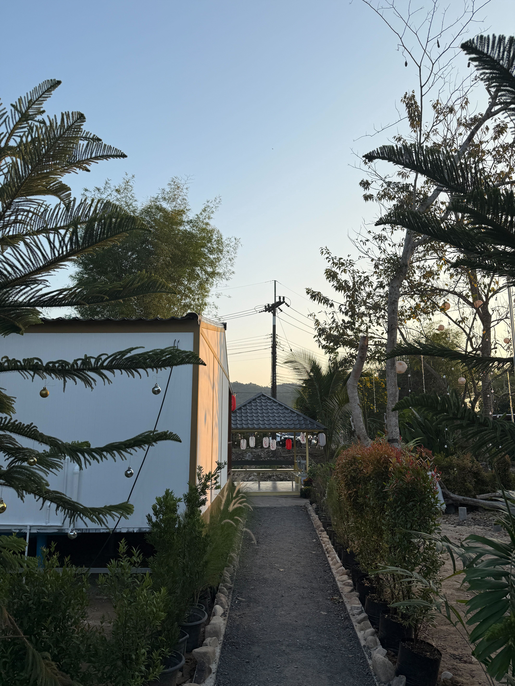

# Phakkay Camping | พักกาย แคมป์ปิ้ง

A luxury, bilingual (Thai/English) landing page for Phakkay Camping resort - a peaceful riverside retreat in Saraburi, Thailand.



## Overview

Phakkay Camping is a boutique resort featuring:
- 🏠 Nordic and Japanese-style accommodations
- 🌊 Riverside location with stunning views
- 🏔️ Near Krok Ee Dok Waterfall (10 min drive)
- 🍳 Free breakfast, WiFi, and minibar

This landing page is built for performance, SEO, and beautiful user experience.

## Tech Stack

| Category | Technology |
|----------|------------|
| Runtime | Bun 1.3+ |
| Framework | Next.js 14 (App Router) |
| Language | TypeScript |
| Styling | Tailwind CSS |
| Animations | Framer Motion |
| i18n | next-intl |
| Maps | Leaflet + OpenStreetMap |
| Image Optimization | Sharp |
| Testing | Jest + Playwright |
| Deployment | Vercel |

## Features

- ⚡ **Fast Loading** - Bun runtime + optimized images for sub-second load times
- 🌏 **Bilingual** - Full Thai and English support
- 📱 **Responsive** - Beautiful on all devices
- 🖼️ **Interactive Gallery** - Categorized gallery with lightbox (Overview, Rooms, River, Food)
- 🏠 **Room Showcase** - Dedicated section for Nordic, Japanese, and A-Frame rooms
- 🗺️ **Location Map** - Interactive Leaflet map
- 📧 **Contact Form** - Inquiry form with LINE, Facebook, and phone options
- 🔍 **SEO Optimized** - Thai/English keywords for Saraburi accommodation searches
- ♿ **Accessible** - WCAG compliant
- 🐛 **Debug-friendly** - All components tagged with `data-component` attributes

## Getting Started

### Prerequisites

- **Bun 1.3+** (recommended) or Node.js 18.x+

#### Install Bun (if not installed)
```bash
curl -fsSL https://bun.sh/install | bash
```

### Installation

1. Clone the repository:
```bash
git clone https://github.com/yourusername/phakkay-camping.git
cd phakkay-camping
```

2. Install dependencies:
```bash
bun install
```

3. Create environment file:
```bash
cp .env.example .env.local
```

4. Add your environment variables:
```env
RESEND_API_KEY=your_resend_api_key
NEXT_PUBLIC_SITE_URL=http://localhost:3000
```

5. Start development server:
```bash
bun run dev
```

Visit [http://localhost:3000](http://localhost:3000)

### Why Bun?

Bun provides significantly faster performance:
- **Package install**: ~5 seconds (vs ~30s with npm)
- **Dev server startup**: ~1 second (vs ~7s with npm)
- **Hot reload**: Near-instant

## Scripts

| Command | Description |
|---------|-------------|
| `bun run dev` | Start development server |
| `bun run build` | Build for production |
| `bun run start` | Start production server |
| `bun run lint` | Check for lint errors |
| `bun run lint:fix` | Fix lint errors |
| `bun run format` | Format with Prettier |
| `bun run test` | Run unit tests |
| `bun run test:watch` | Run tests in watch mode |
| `bun run test:e2e` | Run E2E tests |

> **Note**: You can also use `npm` or `yarn` instead of `bun`, but Bun is recommended for best performance.

## Project Structure

```
phakkay-camping/
├── docs/                    # Documentation
│   └── development-plan/    # Phase-by-phase development plan
├── public/
│   └── images/              # Resort images
├── src/
│   ├── app/
│   │   ├── [locale]/        # Locale-based routing
│   │   ├── api/             # API routes
│   │   └── globals.css      # Global styles
│   ├── components/          # React components
│   ├── i18n/                # Translation files
│   └── lib/                 # Utility functions
├── tests/
│   ├── unit/                # Jest unit tests
│   └── e2e/                 # Playwright E2E tests
└── package.json
```

## Configuration

### Environment Variables

| Variable | Description | Required |
|----------|-------------|----------|
| `RESEND_API_KEY` | Resend API key for emails | Yes (production) |
| `NEXT_PUBLIC_SITE_URL` | Site URL for metadata | Yes |
| `NEXT_PUBLIC_SENTRY_DSN` | Sentry error tracking | No |

### Tailwind Theme

Custom luxury theme with:
- **Primary**: Earth tones (#a98b60)
- **Accent**: Forest green (#4d965d)
- **Cream**: Warm backgrounds (#faf7f2)
- **River**: Subtle blue (#5993ab)

## Testing

### Unit Tests
```bash
bun run test
bun run test:coverage
```

### E2E Tests
```bash
bun run test:e2e
bun run test:e2e:ui  # With UI
```

## Deployment

### Vercel (Recommended)

1. Push to GitHub
2. Import to [Vercel](https://vercel.com)
3. Add environment variables
4. Deploy

### Manual

```bash
bun run build
bun run start
```

## Contributing

### Quick Start for Contributors

1. Fork and clone the repository
2. Install Bun: `curl -fsSL https://bun.sh/install | bash`
3. Install dependencies: `bun install`
4. Start dev server: `bun run dev`
5. Make your changes
6. Run linting and tests:
   ```bash
   bun run lint
   bun run format
   bun run test
   ```

### Git Workflow

1. Create feature branch: `git checkout -b feature/amazing-feature`
2. Commit changes: `git commit -m 'feat: add amazing feature'`
3. Push to branch: `git push origin feature/amazing-feature`
4. Open Pull Request

### Code Style

- Follow ESLint rules (run `bun run lint:fix` to auto-fix)
- Use Prettier for formatting (run `bun run format`)
- Write tests for new features
- Use semantic commit messages
- Add `data-component` attribute to new components for debugging

### Commit Convention

```
feat: add new feature
fix: bug fix
docs: documentation changes
style: formatting changes
refactor: code refactoring
test: add tests
chore: maintenance tasks
```

### Component Guidelines

- All components should have `data-component="component-name"` attribute
- Use `next/image` with `unoptimized` prop for gallery images
- Follow existing i18n patterns (add strings to both `en.json` and `th.json`)
- Use Tailwind CSS classes following the existing theme

## License

This project is private and proprietary to Phakkay Camping.

## Contact

- **Resort**: [Phone number to be added]
- **Location**: 391 Cha Om, Kaeng Khoi District, Saraburi 18110, Thailand
- **Developer**: [Your contact]

---

Built with ❤️ for Phakkay Camping

